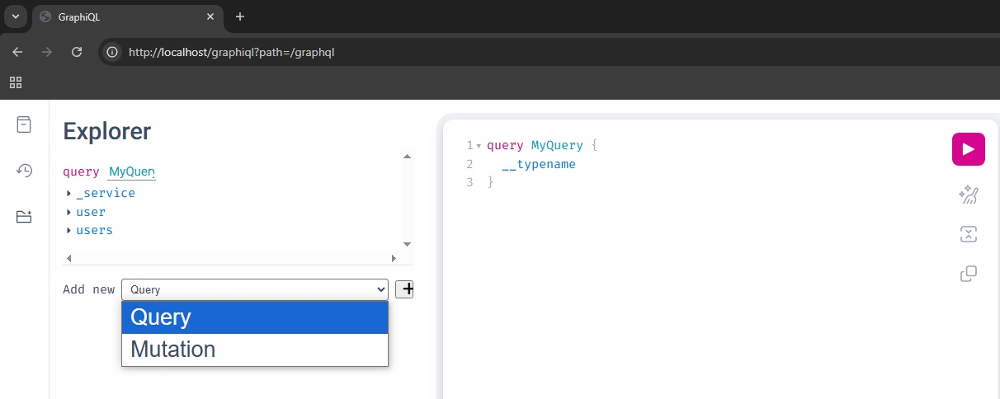

# How to use GraphQL with Spring Boot and H2 database
Example DGS Framework for GraphQL in Spring Boot and run project using Docker


## Author

- **Milan Karajović**
- **email:** milan.karajovic.rs@gmail.com
- **Portfolio:** [https://milan.karajovic.rs](https://milan.karajovic.rs/)


## Tech Stack

**Server:** 
- Java 17, 
- Spring Boot 3.4.3, 
- Netflix DGS GraphQL 10.0.4
- JPA
- Maven
- Lombok
- JUnit

**Database:**
- H2

**Start application:**
- Docker

## Documentation

The application demonstrates how to create an effective application that implements GraphQL using the [Netflix DGS](https://netflix.github.io/dgs/) framework in the [Spring Boot](https://spring.io/projects/spring-boot) application. GraphQL give you  powerful tools like GraphiQL. Know exactly what data you can request from your API without leaving your editor, highlight potential issues before sending a query, and take advantage of improved code intelligence.

## Introduction
GraphQL is a query language for APIs and a runtime for fulfilling those queries with your existing data. GraphQL provides a complete and understandable description of the data in your API, gives clients the power to ask for exactly what they need and nothing more, makes it easier to evolve APIs over time, and enables powerful developer tools.
GraphQL give you next features:
- Ask for what you need, get exactly that
- Get many resources in a single request
- Describe what's possible with a type system


### Application development and analysis
- Create spring Boot applciation using [Spring Initializr](https://start.spring.io/). Setup is shown on the picture below:

  

- The DGS framework is designed for schema first development. The framework picks up any schema files in the src/main/resources/schema folder. We created schema file schema.graphql. In this file are defined types, queries and mutations. Regarding this class we create classes in specific packages in the application.

- It is possible using DGS plugin to generated Java source code using previously defined GraphQL schemas. However, I prefer to use Lombok annotations, so I did that manually.

- This is application structure:

  

- The most important clases are:

    - **Domain**: (src/main/java/rs/karajovic/milan/graphql_spring_boot/domain) - Thera are defined domain object which exists in the above mentioned file **schema\schema.graphql** .
      - User.java
      - CreateUserInput.java
      - UpdateUserInput.java

    - **Repository**: (src/main/java/rs/karajovic/milan/graphql_spring_boot/repository) - Thera are defined JPA repository which is used from the application to communicate with databse.
      - UserRepository.java

    - **Service**: (src/main/java/rs/karajovic/milan/graphql_spring_boot/service) - Service is layer which is between fatcher and repository.
      - UserService.java

    - **Fetcher**: (src/main/java/rs/karajovic/milan/graphql_spring_boot/fetcher) - This is central part of the DGS GraphQL application. There are defined **Queries** and **Mutations** regarding to the declaration in the schema.graphql file.
      - UserFetcher.java
      - UserMutation.java
          - **Clarification**:
            - Netflix DGS provides annotation-based support for Spring Boot.
            - <u>The *UserFetcher* is responsible for defining queries related to the User object. We should annotate such a class with **@DgsComponent** . Then, we have to annotate every query method with **@DgsData** . The fields **parentType** and **fields** should match the names declared in GraphQL **schemas** for Queries. We can see that in the file **schema.graphql** are defined two queries, so we have two methods inside UserFetcher. To fetch data from the database are used methodes from the Service class. The last query method findUserById performs advanced filtering based on the user id field passed in the input. To pass an input parameter we should annotate the method argument with **@InputArgument**.</u>
            - <u>In comparison to the UserFetcher, *UserMutation* implementation is similar. The fields parentType and fields should match the names declared in GraphQL schemas for Mutations. To pass an input parameter we should annotate the method argument with **@InputArgument**. To execute Muttaion methodes are used methodes from the Service class.</u>
	  
    - **Database** - For this demo application is used inmemory H2 database. Configuration for the database is in the application.properties file. data.sql script is used for initial filing database with data.

    - **Tests** - Test are in the src/test/java/com/example/presscentric/test_milan_karajovic_presscetnric/fetcher . There are tests for the Queries and Mutations.
	  - UserFetcherTest.java
	  - UserMutationTest.java

## Build, and run application in your environment
- Get the soruce code from Github
- Runa applicaiton in your envirnonment
- Access to the Graphiql:
```bash
	http://localhost:8080/graphiql
```
- Access to the H2 database:
```bash
	http://localhost:8080/h2-console
```

## Build, and run application using docker

- Prerequest is to have installed Docker on your machine.
- Download source code for this exaple from the Github.
- Build the application using Maven (it is assumed that you have maven installed):
```bash
mvn clean install
```
- The .jar file is created in the folder /target: graphql-spring-boot-0.0.1-SNAPSHOT.jar
- Using Docker file, we ceate image graphql-spring-boot using next command in the console (It is necessary to open the console in the root folder of the project). The command is:
```bash
docker build -t graphql-spring-boot .
```
- Now, we can start applciaton using docker-compose.yaml file.  (It is necessary to open the console in the root folder of the project). The command is:
```bash
docker-compose up
```
- After application is success started, let’s just use the GraphiQL tool to run test queries. It is automatically included in the application by the Netflix DGS library. We may display it by invoking the URL http://localhost/graphiql . 
 - GraphQL tool dashboard. There are all Queries and Mutations:
  
 - Show all users in database using Query:
  
 - Crete user using Mutation:
  
 - Show all users after creted new user in the previous step:
  
 - Delte user by id = 1:
  
 - You can check all Queries and Mutation yourself using this dashboard.
 
## Support

- **Milan Karajović**
- **email:** milan.karajovic.rs@gmail.com
- **Portfolio:** [https://milan.karajovic.rs](https://milan.karajovic.rs/)
- **LinkedIn:** [https://www.linkedin.com/in/milan-karajovic-java-angular-security-cloud-architect/](https://www.linkedin.com/in/milan-karajovic-java-angular-security-cloud-architect/)
